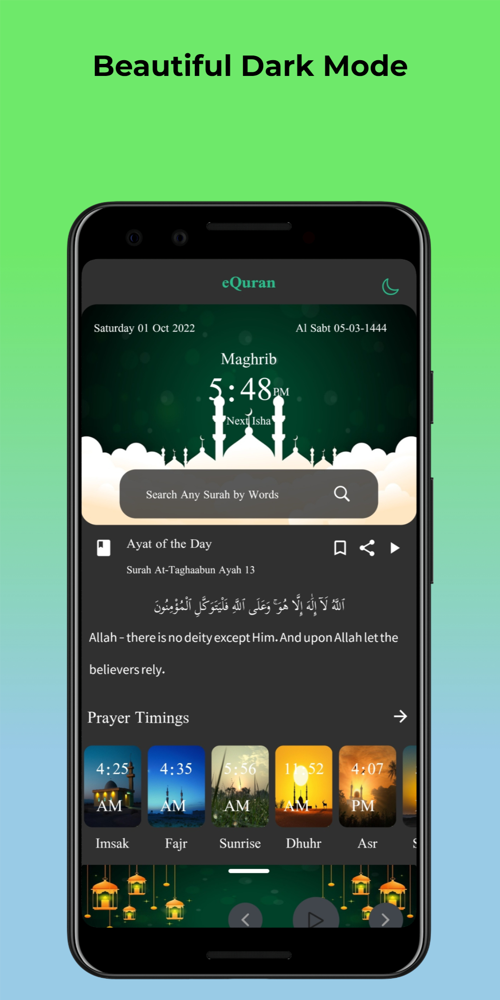

# eQuran App

eQuran App is build using Flutter and currently available for 
Play Store. [Play Store Link](https://play.google.com/store/apps/details?id=com.maqsoodahmadtech.quran)

## Features
- Full Quran both in Audio and Text Format
- 134 Reciters Available
- 39 Audio Translations
- 119 Ayah by Ayah Translaton
- Light/dark mode toggle
- Cross platform Android(Tested), iOS,Windows
- Background Play
- and lot more...

## Screenshots

  
  
  
  
  
  
  
  

## Inspirations

A lot of Islamic Apps are available on the internet today but most of 
them show Ads (Ads are not Islamic according to many Muslim scholars),
and sometime they sell their user data to bad people (like MuslimPro once sold their data to Uncle Sam Military).

- I want to create an app which is best among all and doesn't reveal their user data to anybody.
-To make some of above goals possibles, is to NOT GET USER DATA, which is done in this app.

- All the user bookmarks, prayer timing according to their cities never left the app.

## Roadmap

- Write a good and meaningful Roadmap

- Search Feature throughout the app

- Tajweed Feature

- Remember user prayer progress and notify if he/she is lagging

- and so on. 

## Documentation

Contribute to this project by adding proper documentation.

## Contributing

Contributions are always welcome!

Please write `contributing.md` guide for ways to get started.

Make a pull request and I will publish it as soon as possible.

Please adhere to this project's `code of conduct`.

## Running Tests

I could not write tests, anyone can write tests and send a pull request. I will publish it as soon as possible.

## 🚀 About Me
I'm a your fellow Muslim brother, doing my part...

